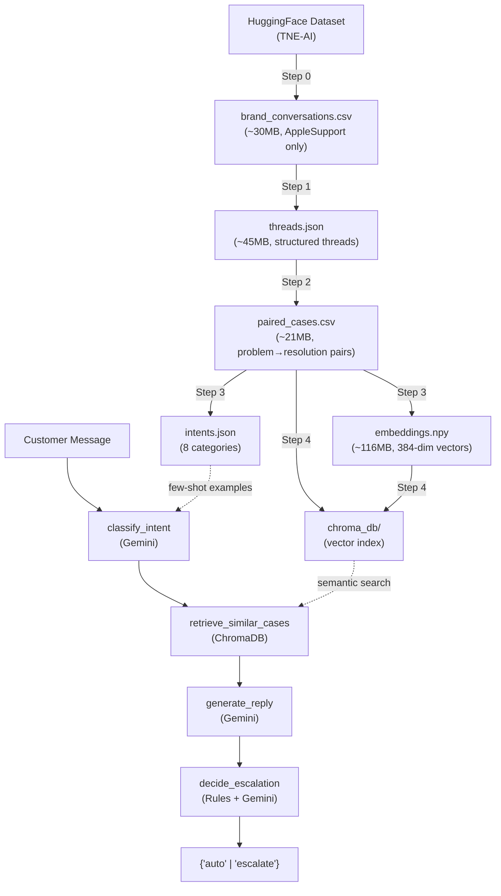

# AI Customer-Support Agent — Full Project Context

## TL;DR

This is a **RAG-based AI customer support agent** that mimics **@AppleSupport** on Twitter. Given a customer message, it:

1. **Classifies** the intent (one of 8 categories) using few-shot prompting with Gemini
2. **Retrieves** similar historical support threads from a ChromaDB vector store
3. **Generates** a grounded reply that mirrors Apple's real tone
4. **Decides** whether to auto-send or escalate to a human (deterministic rules + LLM judge)

The knowledge base is built offline from **~75k real AppleSupport Twitter conversations** (HuggingFace dataset). Two test harnesses exist: one for intent classification accuracy and one that scores generated replies against ground truth using Groq (Qwen 3.8-27B) as a judge.

---

## Architecture Overview

```
┌─────────────────────────────────────────────────────────────┐
│                      OFFLINE PIPELINE                       │
│   (Run once to build the knowledge base)                    │
│                                                             │
│   00_download  → 01_threads → 02_pairs → 03_intents → 04_index  │
│   (HuggingFace)  (JSON)      (CSV)      (JSON)      (ChromaDB)  │
└─────────────────────────────────────────────────────────────┘
                           ↓ produces data/
┌─────────────────────────────────────────────────────────────┐
│                      ONLINE PIPELINE                        │
│   pipeline.py → handle_message(text)                        │
│                                                             │
│   classify_intent ──→ retrieve_similar_cases ──→ generate_reply ──→ decide_escalation  │
│   (Gemini LLM)        (ChromaDB + MiniLM)       (Gemini LLM)       (Rules + Gemini)   │
│                                                             │
│   Returns: {intent, confidence, cases, draft_reply, decision, reason}  │
└─────────────────────────────────────────────────────────────┘
```

---

## Project Structure

```
ai support agent/
├── .env                          # API keys (Gemini + Groq)
├── requirements.txt              # Python dependencies
├── pipeline.py                   # Main entry point — handle_message()
├── context.md                    # This file
├── README.md                     # Setup & usage guide
├── sample.csv                    # Small sample dataset
│
├── agent/                        # Online inference modules
│   ├── __init__.py
│   ├── config.py                 # All tunables: paths, models, thresholds, safety keywords
│   ├── classifier.py             # Intent classification (few-shot Gemini)
│   ├── retriever.py              # Semantic search (ChromaDB + sentence-transformers)
│   ├── reply_generator.py        # Grounded reply generation (Gemini)
│   └── escalation.py             # 2-layer escalation: deterministic rules + LLM judge
│
├── offline/                      # Run-once data processing pipeline
│   ├── 00_download_and_select_brand.py   # Download from HuggingFace, filter to AppleSupport
│   ├── 01_reconstruct_threads.py         # Parse conversations into structured threads
│   ├── 02_clean_and_pair.py              # Clean text, create (problem → resolution) pairs
│   ├── 03_derive_intents.py              # KMeans clustering → 8 intent categories
│   └── 04_build_vector_index.py          # Build ChromaDB persistent vector index
│
├── data/                         # Generated data (by offline pipeline)
│   ├── brand_conversations.csv   # ~30 MB — raw AppleSupport conversations
│   ├── threads.json              # ~45 MB — structured conversation threads
│   ├── paired_cases.csv          # ~21 MB — cleaned (customer_problem, brand_resolution) pairs
│   ├── intents.json              # 8 derived intent categories with definitions & examples
│   ├── embeddings.npy            # ~116 MB — 384-dim MiniLM embeddings for all customer messages
│   ├── cluster_labels.npy        # KMeans cluster assignments
│   └── chroma_db/                # Persistent ChromaDB vector index
│
├── test_classifier.py            # Tests intent classification on 9 curated messages
└── test_reply_evaluation.py      # Evaluates generated replies vs ground truth using Groq
```

---

## Offline Pipeline (Data Processing)

The offline pipeline runs **once** to transform raw Twitter data into a searchable knowledge base.

### Step 0 — Download & Filter (`00_download_and_select_brand.py`)
- **Source**: `TNE-AI/customer-support-on-twitter-conversation` on HuggingFace
- **Action**: Downloads the full dataset, filters to `AppleSupport` (highest volume brand)
- **Output**: `data/brand_conversations.csv` (~30 MB, columns: `conversation_id`, `company`, `conversation`, `summary`)
- **Why AppleSupport**: Highest volume, English-only, bounded product surface (iOS, macOS, hardware)

### Step 1 — Reconstruct Threads (`01_reconstruct_threads.py`)
- **Action**: Parses the raw `"Customer: ... Support: ..."` text format into structured JSON
- **Logic**: Regex-splits on role prefixes, assigns `customer` or `brand` roles
- **Filter**: Keeps only threads with ≥1 customer AND ≥1 brand message, ≥2 total messages
- **Output**: `data/threads.json` (~45 MB)

### Step 2 — Clean & Pair (`02_clean_and_pair.py`)
- **Cleaning**: Strips `@mentions`, URLs, hashtags, agent initials (`^RR`), HTML entities, collapses whitespace
- **Pairing**: For each thread:
  - `customer_problem` = all customer messages joined with ` | `
  - `brand_resolution` = last non-boilerplate brand reply (prefers substantive replies over "DM us" boilerplate)
- **Boilerplate detection**: Regex patterns for "please DM us", link-only replies, etc.
- **Filter**: Both sides must be ≥10 characters
- **Output**: `data/paired_cases.csv` (~21 MB, columns: `thread_id`, `customer_problem`, `brand_resolution`)

### Step 3 — Derive Intents (`03_derive_intents.py`)
- **Embedding**: `all-MiniLM-L6-v2` (384-dim, local, no API needed)
- **Clustering**: KMeans with `k=8`, `random_state=42`, `n_init=10`
- **Naming**: Keyword-frequency heuristic maps clusters to human-readable names
- **Output**: `data/intents.json` + `embeddings.npy` + `cluster_labels.npy`

### Step 4 — Build Vector Index (`04_build_vector_index.py`)
- **Action**: Loads embeddings + cluster labels, creates a persistent ChromaDB collection
- **Metadata per entry**: `customer_problem` (capped at 500 chars), `brand_resolution` (capped at 500 chars), `intent`, `thread_id`
- **Batch size**: 500 entries per insert
- **Output**: `data/chroma_db/`

---

## Online Pipeline (Inference)

Entry point: `pipeline.py` → `handle_message(text) → dict`

### Step 1 — Intent Classification (`agent/classifier.py`)
- **Method**: Few-shot prompting with Gemini (`gemini-3.6-flash`)
- **Prompt**: Includes all 8 intent definitions + 3 examples each from `intents.json`
- **Output format**: Raw JSON `{"intent": str, "confidence": float}`
- **Fallback**: If JSON parsing fails → `{"intent": "unknown", "confidence": 0.0}`
- **Validation**: If predicted intent not in known intents, confidence capped at 0.3

### Step 2 — Semantic Retrieval (`agent/retriever.py`)
- **Embedding model**: `all-MiniLM-L6-v2` (lazy-loaded singleton)
- **Vector store**: ChromaDB persistent client (lazy-loaded singleton)
- **Strategy**:
  1. Try intent-filtered search first (`where={"intent": intent}`)
  2. If <2 results, fall back to unfiltered search
- **Top-K**: 5 results (configurable in `config.py`)
- **Similarity**: Converts ChromaDB L2 distance to `1 - distance/2` (0–1 range)
- **Output**: List of `{customer_problem, brand_resolution, intent, similarity}`

### Step 3 — Reply Generation (`agent/reply_generator.py`)
- **Method**: Gemini with grounded prompt
- **Prompt rules**:
  1. Mirror AppleSupport's real tone (helpful, empathetic, professional, concise)
  2. Ground in historical resolutions (adapt, don't copy)
  3. Never invent account-specific facts
  4. Suggest DM for private info
  5. Keep under 280 characters (Twitter constraint)
- **Output**: Plain text reply string

### Step 4 — Escalation Decision (`agent/escalation.py`)
Two-layer system:

**Layer 1 — Deterministic Rules** (checked first, always wins):
| Rule | Trigger | Threshold |
|---|---|---|
| Safety keywords | Message contains: kill, suicide, lawyer, fraud, bomb, etc. | Any match |
| Low confidence | `confidence < 0.5` | — |
| No retrieval results | Empty `retrieved_cases` | — |
| Poor similarity | Best similarity < `0.25` | — |

**Layer 2 — LLM Judge** (if Layer 1 doesn't trigger):
- Gemini is prompted to **actively look for problems** with the draft
- Escalate criteria: false promises, incorrect advice, complex issues, distressed customer, wrong intent, unaddressed concern
- Output: `{"decision": "auto"|"escalate", "reason": str}`
- JSON parse failure → defaults to `escalate` (fail-safe)

---

## 8 Intent Categories (Data-Derived)

| Intent | Size | Description |
|---|---|---|
| `hardware_and_display` | 14,975 | Screen, touch, camera, Face ID, keyboard issues |
| `performance_issues` | 11,461 | Slow, freezing, crashing, apps not loading |
| `app_and_store_issues` | 11,054 | App Store, iTunes, app downloads, Apple Music |
| `software_update_issues` | 10,194 | Problems caused by iOS/macOS updates |
| `battery_and_power` | 8,373 | Battery life, charging, power drain |
| `connectivity_issues` | 8,085 | WiFi, Bluetooth, cellular, network |
| `account_and_security` | 6,660 | Apple ID, iCloud, password, lockout |
| `general_help_request` | 5,097 | General troubleshooting guidance |

> **Note**: The auto-naming is heuristic-based (keyword frequency), so some cluster labels may not perfectly match their examples (visible in `intents.json` where e.g. `account_and_security` examples are about battery life). This is a known limitation of unsupervised clustering + auto-labeling.

---

## Tech Stack

| Component | Technology | Rationale |
|---|---|---|
| **LLM** | Gemini 3.6 Flash (`google-genai`) | Fast, cheap, configurable |
| **Embeddings** | `all-MiniLM-L6-v2` (sentence-transformers) | 384-dim, runs locally, no API needed |
| **Vector Store** | ChromaDB (persistent) | Lightweight, no separate server |
| **Eval LLM** | Qwen 3.8-27B via Groq | Fast inference for test evaluation |
| **Data Source** | HuggingFace `TNE-AI/customer-support-on-twitter-conversation` | Pre-reconstructed conversation threads |
| **Clustering** | KMeans (scikit-learn) | Simple, deterministic intent derivation |
| **Environment** | Python 3.10+, dotenv | Standard tooling |

### Dependencies (`requirements.txt`)
```
pandas>=2.0, datasets>=2.14, sentence-transformers>=2.2,
scikit-learn>=1.3, chromadb>=0.4, google-genai>=1.0,
python-dotenv>=1.0, numpy>=1.24
```
Plus `groq` (imported in config but not listed in requirements.txt — potential issue).

---

## Configuration (`agent/config.py`)

| Parameter | Value | Description |
|---|---|---|
| `LLM_MODEL` | `gemini-3.6-flash` | LLM for classification, reply gen, escalation |
| `EMBEDDING_MODEL` | `all-MiniLM-L6-v2` | Sentence embeddings |
| `TOP_K_RETRIEVAL` | `5` | Number of cases to retrieve |
| `SIMILARITY_THRESHOLD` | `0.25` | Below → auto-escalate |
| `CONFIDENCE_THRESHOLD` | `0.5` | Below → auto-escalate |
| `BRAND` | `AppleSupport` | Target brand |
| `GROQ_EVAL_MODEL` | `qwen/qwen3.8-27b` | Evaluation judge model |
| `SAFETY_KEYWORDS` | 17 keywords | Immediate escalation triggers |

---

## Test Harnesses

### `test_classifier.py`
- 9 curated test messages covering all 8 intents + 1 unknown/irrelevant
- Runs each through `classify_intent()`, checks if predicted intent contains expected keyword
- **Rate limiting**: 12-second sleep between calls (Gemini free tier: 5 RPM)

### `test_reply_evaluation.py`
- Samples 5 random cases from `paired_cases.csv` (fixed `random_state=42`)
- Runs each through the full pipeline (classify → retrieve → generate)
- Evaluates draft reply vs actual brand reply using Groq as judge
- **Scoring**: 0–100 semantic similarity + reasoning
- **Rate limiting**: 12-second sleep between cases

### Latest Test Results (from your terminal output)
| Case | Score | Notes |
|---|---|---|
| iPhone update lost photos | 40/100 | Acknowledged DM but missed the key diagnostic question about backups |
| Phishing email question | Error | 503 — Gemini temporarily overloaded |
| High Sierra slow Mac | 85/100 | Good tone match, slightly verbose |
| Battery life after update | 92/100 | Near-perfect intent + resolution match |
| Typing hieroglyphics | Error | 503 — Gemini temporarily overloaded |

---

## Data Flow Diagram



---

## Known Issues & Caveats

1. **Intent label mismatch**: KMeans + keyword heuristic sometimes assigns wrong labels (e.g., `account_and_security` cluster has battery examples). The unsupervised approach trades accuracy for zero-annotation cost.

2. **Gemini rate limits**: Free tier is capped at ~5 RPM. Tests add 12-second sleeps. The `503 UNAVAILABLE` errors in test runs are transient.

3. **`groq` not in requirements.txt**: The `groq` package is imported in `config.py` but not listed in `requirements.txt`. Would cause import errors if not manually installed.

4. **AFC warning**: `"Direct use of automatic function calling (AFC) in Models.generate_content is not recommended"` — this is a Gemini SDK warning; functionally harmless but could be cleaned up by switching to `Chat.send_message`.

5. **ChromaDB metadata truncation**: Customer problems and brand resolutions are capped at 500 chars in the vector index. Long conversations may lose context.

6. **No persistence of inference results**: The pipeline returns a dict but doesn't log or store results anywhere.

7. **Single-brand**: Currently hardcoded to AppleSupport. Extending to other brands requires re-running the offline pipeline with a different `BRAND` filter.
